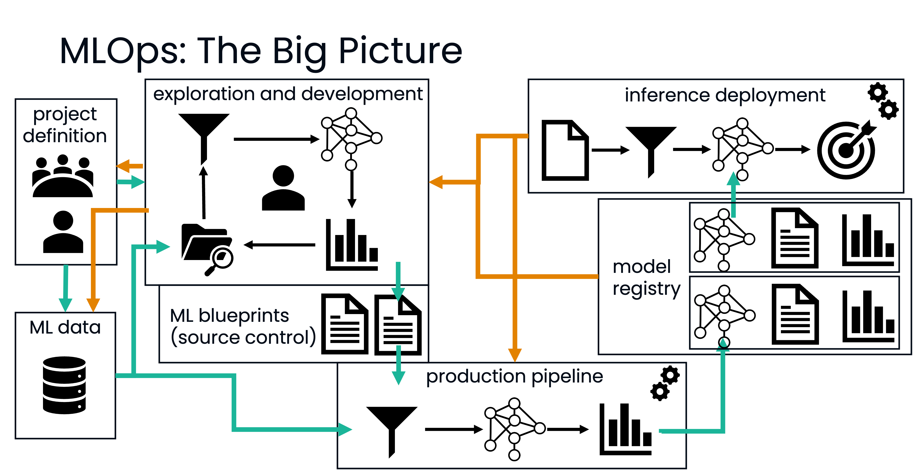

# MIMER MLOps Course - Hands-on session

In this hands-on session, you will experience working within the MLOps approach and loops that were discussed in the lectures.

You are a team of data scientists / ML engineers tasked to predict failures and estimate remaining lifetime of jet engines. You have been provided with data collected from various engines and need to deploy a model that can predict this.

## How to Proceed
One of the first hands-on steps in the MLOps cycle is iterative exploration and experimentation with data and candidate models. You can do so using notebooks on Jupyter Lab. Start from the provided `exploration.ipynb` notebook. Feel free to experiment with different data analysis techniques and models. Frameworks for machine learning are included in the project already, and you can add more (see below for details).

Once you believe you have a robust data processing and ML training approach, it is time to bring this to production. Modularize your model, data preprocessing and hyperparameter tuning into standalone functions and classes within the project's codebase (i.e., inside `src/mlops_project`). Adapt the code in the `train` function in `train.py` to utilize your model and functions. Remember from the lectures! Minimize code duplication and make sure to use consistently the same code between training and inference. The `src` folder already contains dummy code showcasing how you can use the MLFlow library to define arbitrary models with code for training and inference, and how to register them in the model registry.

Whenever you want to (re-)train and register a model, run `uv run train` yourself (see "Running Locally" below) -- there's no automated pipeline in this version of the project; training happens on demand, on your own machine.

Once a model is registered, you will be able to find it in the MLFlow web UI.

Refer back to the lecture notes or the lecture videos to recall the workflow of MLOps.



## Included frameworks
This repository already includes Pandas (data processing), MLFlow (experiment tracking and model registry), and Scikit-learn (ML models) as dependencies, along with Jupyter Lab for exploration. Additional dependencies -- for example XGBoost (decision trees) or Optuna (hyperparameter tuning) -- can be included by using `uv add <package-name>` as your approach develops.

## Running Locally
It is required to install `uv` following [these instructions](https://docs.astral.sh/uv/getting-started/installation/).

Run `uv sync` to download the project dependencies. You can then run `uv run jupyter lab` to start a local jupyter server accessible from your browser.

### Setting up MLflow tracking

MLflow needs a tracking server running, so you have a web UI to browse experiments and registered models, and so `mlflow models serve` can find your registered models later.

Start the server once, in its own terminal:

```bash
uv run mlflow server --port 8880 --backend-store-uri sqlite:///mlruns.db
```

Leave that running. In every *other* terminal you use for this project (training, prediction, or serving a model), point at it by setting:

```bash
export MLFLOW_TRACKING_URI=http://127.0.0.1:8880
```

A local MLflow UI is now browsable at `http://127.0.0.1:8880`.

## Deploying / testing a trained model

To begin with, don't forget to do the following every terminal you use for training, prediction, or serving a model:

```bash
export MLFLOW_TRACKING_URI=http://127.0.0.1:8880
```

Once `uv run train` has registered a model (it will be tagged with the `champion` alias automatically -- see `src/mlops_project/data.py` and `train.py`), you can feed it data and see predictions in two ways. Both are already implemented for you (`src/mlops_project/predict.py` and `predict_via_rest.py`) -- you don't need to write this part yourself.

**In-process** -- load the model directly in Python and call `.predict()`:

```bash
uv run predict
```

**As a served REST endpoint** -- start a small inference server for the registered model, then call it over HTTP the way a separate application would:

```bash
# terminal 1
uv run mlflow models serve --model-uri "models:/turbofan_rul_model@champion" --port 5001 --env-manager=local

# terminal 2
uv run predict-rest
```

Both commands accept `--n <count>` to control how many engines are scored, and `--input <path>` to score a different file than the default test set. Make sure `MLFLOW_TRACKING_URI` is set (see "Setting up MLflow tracking" above) in *every* terminal you use for this -- `mlflow models serve` needs it to find the registered model, exactly like `train.py` does.

## Getting the code

You can get this repository either by downloading it directly ("Download ZIP"), or by using git:

- If you don't already have git installed, see the official [installation guide](https://git-scm.com/downloads).
